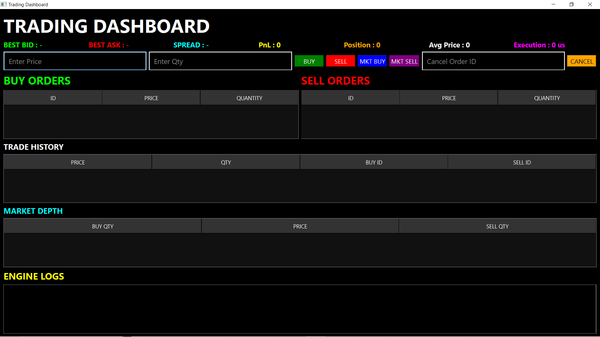
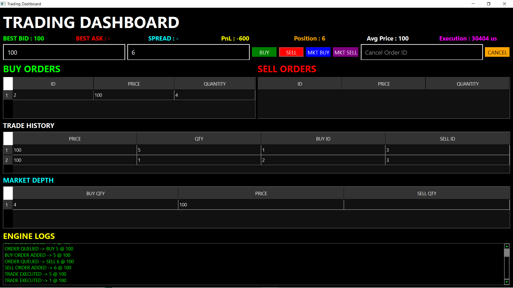
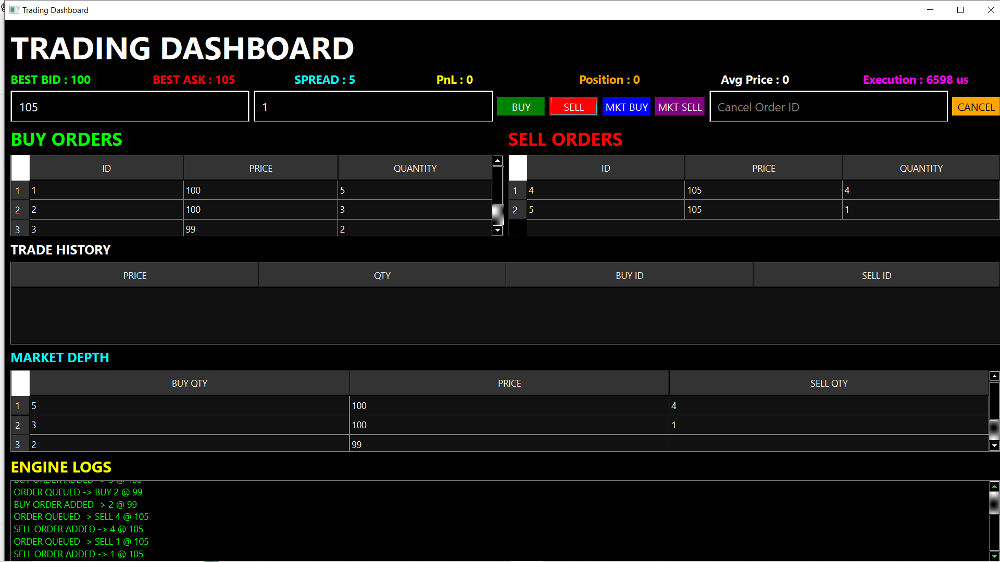
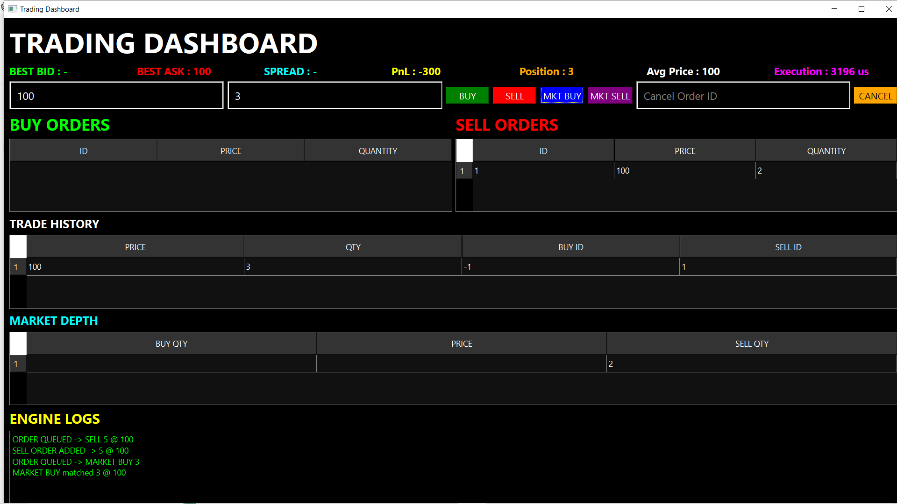

# Real-Time Trading Engine

A high-performance C++ Trading Engine with Order Matching, Market Depth Visualization, FIFO Execution Logic, Trade History Tracking, and Real-Time Dashboard built using Qt.

---

## Features

### Core Trading Engine

- Limit Buy Orders
- Limit Sell Orders
- Market Buy Orders
- Market Sell Orders
- FIFO Price-Time Priority Matching
- Partial Fill Handling
- Order Book Management
- Trade Execution History
- Best Bid / Best Ask Calculation
- Spread Calculation
- Position Tracking
- Average Price Tracking
- PnL Tracking

---

## Dashboard Features

- Real-Time Order Book
- Buy Orders Panel
- Sell Orders Panel
- Market Depth View
- Trade History View
- Engine Logs
- Execution Latency Display

---

## Architecture

```text
User Interface (Qt)
        |
        v
Order Entry Layer
        |
        v
Matching Engine
        |
        v
Order Book
        |
        v
Trade Execution
```

---

## Technologies Used

- C++
- STL
- Qt Framework
- CMake
- Git
- GitHub

---

## Screenshots

### Dashboard



---

### FIFO Order Matching



---

### Market Depth



---

### Market Order Execution



---

## Project Structure

```text
src/
│
├── engine/
│   ├── MatchingEngine.h
│   ├── OrderBook.h
│   ├── Trade.h
│   └── Comparators.h
│
├── models/
│   └── Order.h
│
└── main.cpp
```

---

## Build Instructions

```bash
mkdir build
cd build

cmake ..
cmake --build .

./app
```

---

## Future Enhancements

- Socket-Based Market Data Feed
- Multi-Client Trading Simulation
- Portfolio Management
- Risk Management Module
- Persistent Database Storage
- REST API Integration

---

## Author

Kunal Thakare

C++ Developer | Trading Systems Enthusiast
